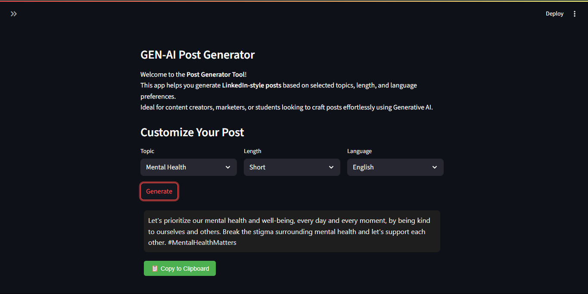

# Post Generator Gen-AI
Post Generator GenAI is an intelligent content generation tool that uses few-shot prompting to generate social media posts, articles, or promotional content. Built using Streamlit, it provides an interactive interface for crafting AI-powered posts with minimal input.
## 🚀 Features

- ✨ AI-powered post generation using few-shot learning
- 🧠 Customizable prompt patterns for different post styles
- 📋 Copy-to-clipboard functionality for easy content reuse
- 📁 Modular code structure for easy maintenance
- 💬 Developer-friendly with support for multiple use cases

## 🛠️ Tech Stack

- **Frontend:** Streamlit
- **Backend:** Python
- **Libraries:** OpenAI API (or LLM backend), few-shot prompt templates
- **Others:** HTML/CSS for styling, `dotenv` for environment config

## Set-up
1. To get started we first need to get an API_KEY from here: https://console.groq.com/keys. Inside `.env` update the value of `GROQ_API_KEY` with the API_KEY you created. 
2. To get started, first install the dependencies using:
    ```commandline
     pip install -r requirements.txt
    ```
3. Run the streamlit app:
   ```commandline
   streamlit run main.py
   ```

## 🖼️ Demo



---

### Disclaimer

This project is an adaptation of original work by **Codebasics Inc.**  
I do **not** claim ownership of the original idea or base implementation.

> **Copyright (C) Codebasics Inc. All rights reserved.**  
> **Additional Terms:** This software is licensed under the MIT License. However, commercial use of this software is strictly prohibited without prior written permission from the author. Attribution must be given in all copies or substantial portions of the software.
